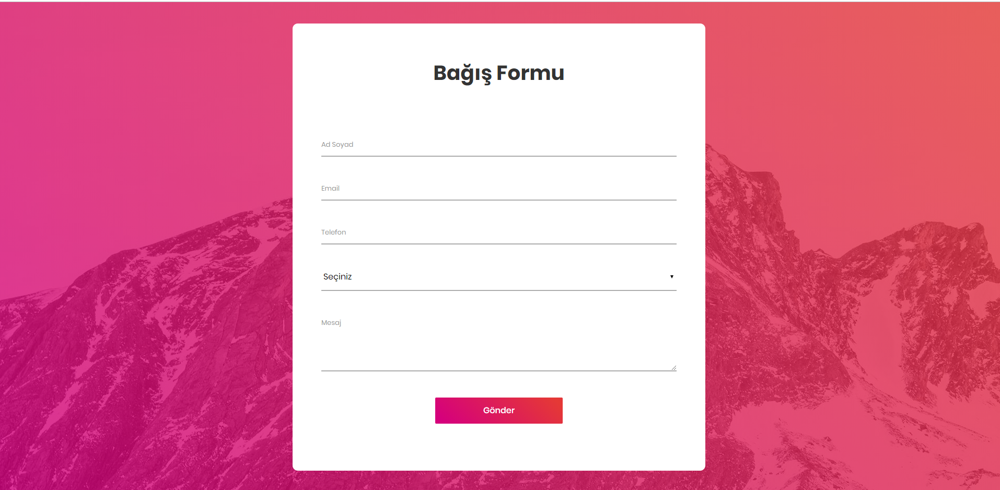
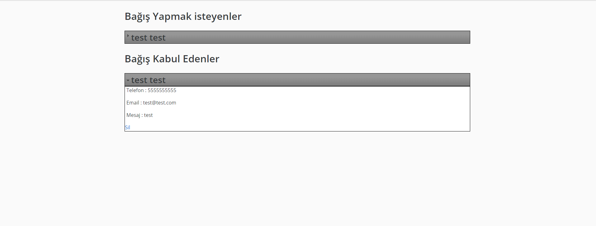

# favorWeb
Yardımlaşma Ağı Kurmanın En Kolay Yolu...

FavorWeb teknik açıdan küçük ve basit olmak ile birlikte güzel bir fikir ile ortaya çıkmış ve daha emekleme aşamasında dahi olmayan bir projedir. Burada şimdiden paylaşmamın başlıca sebebi bir an önce böyle bir uygulamaya ihtiyaç duyan insanların ihtiyaçlarını karşılamak istememdir. FavorWeb hiç bir maddi kazanç amacı gütmeden sadece yardımı amaçlamaktadır. Bu yüzden kısa süre içinde resimli ve videolu olmak üzere kurulumu detaylı şekilde anlatılacaktır. **Teknik açıdan sorun yaşayan veya teknik bilgisi olmayıp insanlara yardım etmek isteyen her arkadaşım için adım adım ilgilenip kurulumu ben gerçekleştire bilirim.**

# İletişim : m.bakimermer@gmail.com

FavorWeb : Basit olarak iki kısımdan oluşmaktadır. Kullananıcıların gördüğü bir form sayfası ve form kayıtlarını listeleyen bir yönetici sayfasından oluşmaktadır. Kullanıcılar form üzerinden iletişim bilgilerini girerek bağış yapmak veya bağış kabul etmek istediklerini belirttikten sonra mesaj kısmına bağış ile ilgili detayı girmektedir. Yönetici ise kullanıcıların doldurduğu form kayıtlarını sayfada görerek onlarla iletişime geçmektedir. Kısaca FavorWeb yardımlaşmak isteyenlere yardımı ve bağışların organize edilerek, daha fazla kişiye ulaşmak içinde interneti kullanmayı amaçlamaktadır.

